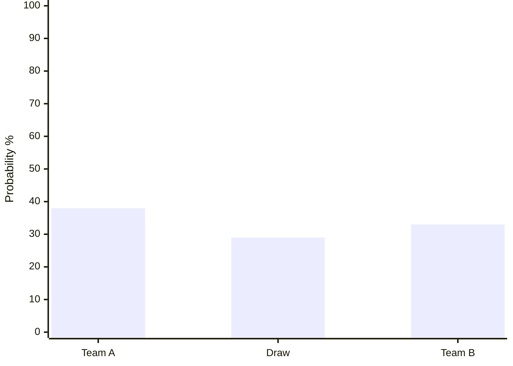
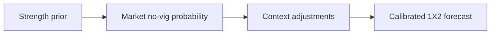

# Output Formats Reference

Use this reference when the user asks for tables, visual explanation, source audit, JSON, or a report-ready result.

## Markdown Table Bundle

### Probability Table

```markdown
| Result | Model probability | Market no-vig probability | Difference |
| --- | ---: | ---: | ---: |
| Team A win | 38% | 36% | +2 pp |
| Draw | 29% | 30% | -1 pp |
| Team B win | 33% | 34% | -1 pp |
```

### Evidence Table

```markdown
| Evidence | Current signal | Reliability | Forecast impact | Source |
| --- | --- | --- | --- | --- |
| Team strength | Team A higher Elo | High | Team A + | [World Football Elo](https://...) |
| Injury | Team B striker doubtful | Medium | Team B - | [Source](https://...) |
```

### Source Table

```markdown
| Source | Type | Used for | Reliability | Retrieved | Link |
| --- | --- | --- | --- | --- | --- |
| FIFA | official | fixture metadata | High | 2026-06-03 | [open](https://...) |
```

Every source table row must contain a clickable source link.

## Mermaid / Text Visuals

Use Mermaid only when the destination supports it. Otherwise use Markdown tables.

### Probability Bar Sketch



### Evidence Flow



## JSON Schema

Use this when another agent or application needs structured output:

```json
{
  "match": {
    "team_a": "Team A",
    "team_b": "Team B",
    "competition": "FIFA World Cup",
    "stage": "Group stage",
    "date": "YYYY-MM-DD",
    "target": "90_min_1x2"
  },
  "probabilities": {
    "team_a_win": 0.38,
    "draw": 0.29,
    "team_b_win": 0.33
  },
  "confidence": "medium",
  "lean": "team_a",
  "key_reasons": [
    "Team A has a stronger rating baseline.",
    "Market no-vig prices are close to the model.",
    "Lineup uncertainty limits confidence."
  ],
  "uncertainties": [
    "Starting lineup not confirmed."
  ],
  "sources": [
    {
      "title": "FIFA match page",
      "type": "official",
      "url": "https://...",
      "retrieved_at": "YYYY-MM-DD",
      "reliability": "high",
      "used_for": "fixture"
    }
  ]
}
```

## Report-Ready Order

1. Short forecast.
2. Probability table.
3. Key reasons.
4. Key uncertainty.
5. Market vs model table.
6. Source table with clickable links.
7. Technical appendix if requested.
